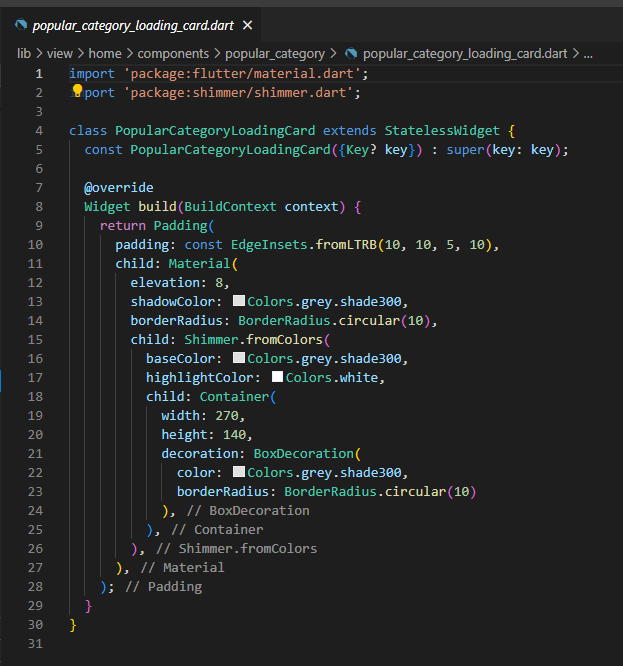

# Mini_Project

Nama : Ditya Anggraeni

Program : Become a Flutter Master, From Zero to Hero

Repo : https://github.com/Rae2108/Mini_Project

## LOGIKA PROGRAM

Component : 

- [mainheader1.PNG](./Screenshot/mainheader1.PNG) [mainheader1_1.PNG](./Screenshot/mainheader1_1.PNG)

 

Controller : 

- [controllers.PNG](./Screenshot/controllers.PNG) 

 

- [dashboardcontrollers.PNG](./Screenshot/dashboardcontrollers.PNG)

- [homecontrollers1.PNG](./Screenshot/homecontrollers1.PNG) [homecontrollers1_1.PNG](./Screenshot/homecontrollers1_1.PNG)

 

Model :

- [addbenner.PNG](./Screenshot/addbenner.PNG) 

 

- [category.PNG](./Screenshot/category.PNG) 

 

Route : 

- [appage.PNG](./Screenshot/appage.PNG) 

 

- [approute.PNG](./Screenshot/approute.PNG) 

 

Service : 

- [remotebanner.PNG](./Screenshot/remotebanner.PNG) 

- [remotecategory.PNG](./Screenshot/remotecategory.PNG) 

Theme : 

- [apptheme1.PNG](./Screenshot/apptheme1.PNG) 

 

View :
    - Account
 - [accountscreen1.PNG](./Screenshot/accountscreen1.PNG) [accountscreen1_1.PNG](./Screenshot/accountscreen1_1.PNG) [accountscreen1_2.PNG](./Screenshot/accountscreen1_2.PNG)

   

 - [login1.PNG](./Screenshot/login1.PNG) [login1_1.PNG](./Screenshot/login1_1.PNG) 

  

 - [signup1.PNG](./Screenshot/signup1.PNG) [signup1_1.PNG](./Screenshot/signup1_1.PNG) [signup1_2.PNG](./Screenshot/signup1_2.PNG)

   

- Category 
 - [categoryscreen1.PNG](./Screenshot/categoryscreen1.PNG) [categoryscreen1_1.PNG](./Screenshot/categoryscreen1_1.PNG) 

  

- Dashboard : 

- [dasboardbinding.PNG](./Screenshot/dasboardbinding.PNG) 

- [dashboardscreen1.PNG](./Screenshot/dashboardscreen1.PNG) [dashboardscreen1_1.PNG](./Screenshot/dashboardscreen1_1.PNG) 

  

- Home :

- [bannercard1.PNG](./Screenshot/bannercard1.PNG) [bannercard1_1.PNG](./Screenshot/bannercard1_1.PNG) 

  

- [carauselloading1.PNG](./Screenshot/carauselloading1.PNG) [carauselloading1_1.PNG](.    /Screenshot/carauselloading1_1.PNG) 

 

- [carauselslider1.PNG](./Screenshot/carauselslider1.PNG) [carauselslider1_1.PNG](./Screenshot/carauselslider1_1.PNG) 

 

- [popularcategory.PNG](./Screenshot/popularcategory.PNG) 

- [popularcategorycard1.PNG](./Screenshot/popularcategorycard1.PNG) [popularcategorycard1_1.PNG](./Screenshot/popularcategorycard1_1.PNG) [popularcategorycard1_2.PNG](./Screenshot/popularcategorycard1_2.PNG) 

   

- [popularcategoryloadingcard.PNG](./Screenshot/popularcategoryloadingcard.PNG) 

- [popularcategoryloadingcard1.PNG](./Screenshot/popularcategoryloadingcard1.PNG) 

- [sectiontittle.PNG](./Screenshot/sectiontittle.PNG) 

- [homescreen1.PNG](./Screenshot/homescreen1.PNG) [homescreen1_1.PNG](./Screenshot/homescreen1_1.PNG) 

 

- [menuscreen1.PNG](./Screenshot/menuscreen1.PNG) [menuscreen1_1.PNG](./Screenshot/menuscreen1_1.PNG) 

  

- [const.PNG](./Screenshot/const.PNG) 

- [main.PNG](./Screenshot/main.PNG) 

# Output 

- [Output1.PNG](./Screenshot/Output1.PNG) [Output2.PNG](./Screenshot/Output2.PNG) [Output3.PNG](./Screenshot/Output3.PNG) [Output4.PNG](./Screenshot/Output4.PNG) [Output5.PNG](./Screenshot/Output5.PNG) 

    